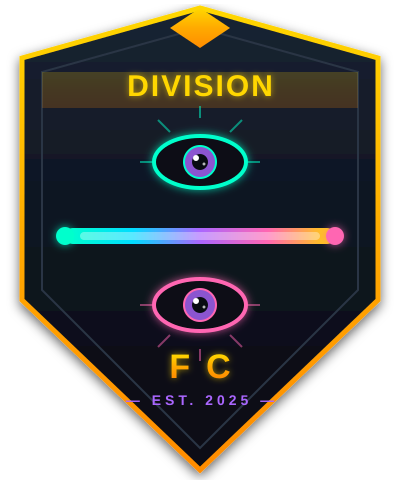

# ⚽ Division FC Soccer Analytics

<p align="center">
  
</p>

<p align="center">
  <strong>Professional soccer visualizations with the "Midnight Aurora" brand identity</strong>
</p>

---

## 🎯 Key Feature: Single Configuration Point

All match settings are in **ONE place**: `config/match_config.py`

```python
MATCH_CONFIG = {
    "competition_name": "FIFA World Cup",
    "season": "2022",
    "stage": "Final",
}
```

Change this config, and ALL visualizations and animations update automatically.

---

## 🚀 Quick Start

### Option 1: Command Line

```bash
# Install
pip install -r requirements.txt

# Find available data
python find_data.py

# Run full analysis
python run_analysis.py
```

### Option 2: Jupyter Notebook

```bash
pip install -r requirements.txt
jupyter notebook

# Open: notebooks/analysis.ipynb
```

---

## 🔍 Find Available Data

Use `find_data.py` to discover what competitions, matches, teams, and stages are available:

```bash
# List all competitions
python find_data.py

# List matches for a competition
python find_data.py --matches "FIFA World Cup" "2022"

# List teams in a competition
python find_data.py --teams "La Liga" "2020"

# List stages (knockout rounds, etc.)
python find_data.py --stages "Champions League" "2019"
```

### Example Output

```
📋 AVAILABLE COMPETITIONS
========================================

🏆 FIFA World Cup (ID: 43)
   Seasons: 2022, 2018

🏆 La Liga (ID: 11)
   Seasons: 2020/2021, 2019/2020, ...

🏆 Premier League (ID: 2)
   Seasons: 2003/2004
```

---

## 📓 Jupyter Notebook Quick Start

### Cell 1: Setup

```python
import sys
from pathlib import Path

project_root = Path().absolute()
while not (project_root / 'src').exists() and project_root.parent != project_root:
    project_root = project_root.parent
sys.path.insert(0, str(project_root))

print("✅ Setup complete!")
```

### Cell 2: Load Data (from unified config)

```python
from config.match_config import get_match_data, get_home_team, get_away_team

events, match_info = get_match_data()
```

### Cell 3: View Goals

```python
from src.data.loader import get_goals, get_display_name

goals = get_goals(events)
for _, goal in goals.iterrows():
    player = get_display_name(goal['player_name'])  # Shows "Messi" not "Cuccittini"
    print(f"{int(goal['minute'])}' - {player} ({goal['team_name']})")
```

### Cell 4: Regulation Time Only

```python
reg_goals = get_goals(events, regulation_only=True)  # Only 90 min
```

### Cell 5: Run Full Analysis

```python
%run ../run_analysis.py
```

---

## ⚙️ Configuration

### Change the Match

Edit `config/match_config.py`:

```python
MATCH_CONFIG = {
    "competition_name": "FIFA World Cup",  # Search string
    "season": "2022",                       # Season year
    "stage": "Final",                       # Final, Semi-final, etc.
    
    # Or specify teams:
    "home_team": "Argentina",
    "away_team": "France",
}
```

### Available Competitions

```python
from src.data.loader import StatsBombLoader

loader = StatsBombLoader()
print(loader.list_competitions())
```

---

## 📊 Visualizations

All functions use the unified config automatically:

| Visualization | Description |
|---------------|-------------|
| `create_shot_map()` | Player shot locations with xG |
| `create_touch_heatmap()` | Activity density heatmap |
| `create_pass_network()` | Team passing connections |
| `create_zone_control()` | Territorial dominance (3x3 grid) |
| `create_match_summary()` | Instagram-ready summary |

### Example

```python
from run_analysis import create_shot_map
from config.match_config import get_match_data
from src.data.loader import get_top_players_by_stat

events, match_info = get_match_data()
top_shooter = get_top_players_by_stat(events, match_info['home_team'], 'shots', n=1)[0]

create_shot_map(events, top_shooter, 'my_shot_map.png')
```

---

## 🎬 Animations

```python
from run_analysis import create_goal_animation
from src.data.loader import get_goals

goals = get_goals(events)
goal_minute = int(goals.iloc[0]['minute'])
team = goals.iloc[0]['team_name']

create_goal_animation(events, goal_minute, team, 'goal.gif')
```

---

## 👤 Player Names

StatsBomb uses full legal names. We automatically convert:

| StatsBomb Name | Display Name |
|----------------|--------------|
| Lionel Andrés Messi Cuccittini | Messi |
| Kylian Mbappé Lottin | Mbappé |
| Ángel Di María Hernández | Di María |

```python
from src.data.loader import get_display_name

full_name = "Lionel Andrés Messi Cuccittini"
print(get_display_name(full_name))  # "Messi"
```

---

## 📱 Instagram Export

```python
from src.export.instagram import InstagramExporter

exporter = InstagramExporter()
exporter.export_post(fig, 'post.png', add_watermark=True, watermark_text='@divisionfc')
exporter.export_story(fig, 'story.png')
```

| Format | Dimensions |
|--------|------------|
| Square Post | 1080 × 1080 |
| Portrait Post | 1080 × 1350 |
| Story/Reel | 1080 × 1920 |

---

## 📁 Project Structure

```
soccer-analytics-viz/
├── config/
│   └── match_config.py      # ⚙️ SINGLE CONFIG POINT
├── find_data.py             # 🔍 Find competitions/matches/teams
├── run_analysis.py          # Main analysis script
├── src/
│   ├── data/
│   │   └── loader.py        # Data loading & player names
│   ├── export/
│   │   └── instagram.py     # Instagram exporter
│   └── animations/
│       └── match_animation.py
├── notebooks/
│   └── analysis.ipynb       # Jupyter notebook
├── output/
│   ├── images/              # Generated PNGs
│   └── gifs/                # Generated GIFs
├── run_analysis.py          # Main analysis script
└── requirements.txt
```

---

## 📁 Output Files

After running `python run_analysis.py`:

```
output/
├── images/
│   ├── messi_shots.png
│   ├── mbappe_shots.png
│   ├── messi_heatmap.png
│   ├── argentina_passes.png
│   ├── france_passes.png
│   ├── zone_control.png
│   └── match_summary.png
└── gifs/
    ├── argentina_goal.gif
    └── france_goal.gif
```

---

## 🙏 Credits

| Source | Type | License |
|--------|------|---------|
| **StatsBomb** | Data | CC BY 4.0 |
| **mplsoccer** | Library | MIT |

---

<p align="center">
  Made with ⚽ by Division FC
</p>
